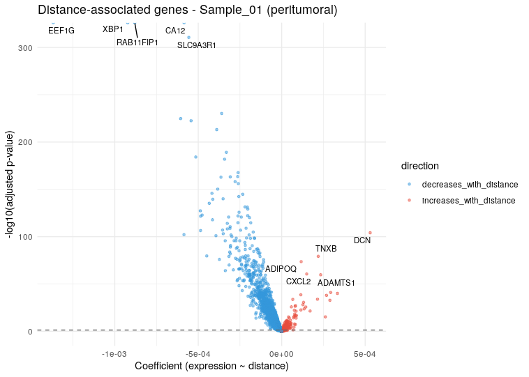
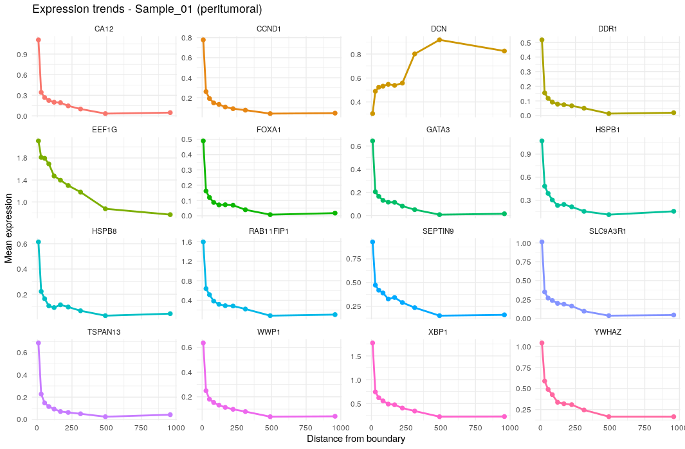
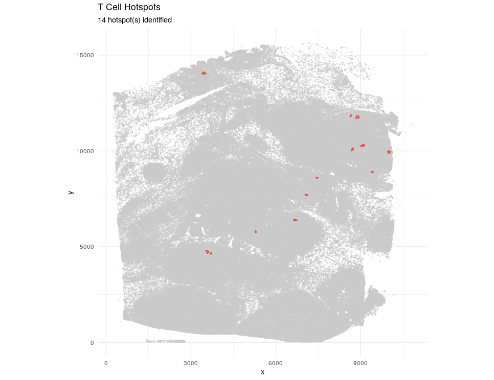

# Gene-Distance Analysis

## Introduction

stGradient provides tools to model individual gene expression as a
function of distance from tumor boundaries or T-cell hotspots. This
identifies genes whose expression systematically increases or decreases
with distance from key spatial landmarks.

## Boundary Distance-Gene Analysis

### Step 1: Compute Signed Distance

First, compute a per-cell signed distance using a concave hull boundary:

``` r

library(stGradient)

seurat_obj <- compute_distance_from_boundary(
  seurat_obj,
  polygon_col = "inside_polygon",
  intratumoral_label = TRUE,
  fov_name = "fov",
  concavity = 2
)
```

This adds `dist_to_boundary` and `abs_dist_to_boundary` metadata
columns. Negative values indicate intratumoral cells, positive values
indicate peritumoral/stromal cells.

### Step 2: Find Distance-Associated Genes

Fit per-gene linear models and Spearman correlations:

``` r

dist_res <- find_distance_associated_genes(
  seurat_obj,
  assay = "Xenium",
  focus = "peritumoral",
  min_cells_expressing = 10,
  n_distance_bins = 10,
  max_dist_quantile = 0.95,
  p_adj_threshold = 0.05
)
```

#### Focus Options

| Focus            | Cells Analyzed                                        |
|------------------|-------------------------------------------------------|
| `"peritumoral"`  | Only cells outside the tumor boundary (distance \> 0) |
| `"intratumoral"` | Only cells inside the tumor boundary (distance ≤ 0)   |
| `"both"`         | All cells                                             |

### Step 3: Visualize Results

``` r

dist_plots <- plot_distance_genes(dist_res, top_n = 12, sample_label = "Sample_01")

# Volcano plot of gene significance
dist_plots$volcano

# Expression trends for top genes across distance bins
dist_plots$trends
```



## T-Cell Hotspot Distance-Gene Analysis

This workflow identifies genes whose expression changes with distance
from intratumoral CD4/CD8 T-cell hotspots.

### Step 1: Identify Hotspots

Use DBSCAN to detect spatial clusters of T cells within the tumor:

``` r

hs <- define_tcell_hotspots(
  seurat_obj,
  celltype_col = "singleR.predicted.id.brcaAtlas",
  tcell_labels = c("T Cells CD4+", "T Cells CD8+"),
  polygon_col = "inside_polygon",
  intratumoral_label = TRUE,
  eps = 50,
  min_pts = 10,
  min_hotspot_size = 5
)
```

### Step 2: Visualize Hotspots

``` r

plot_tcell_hotspots(seurat_obj, hs, celltype_col = "singleR.predicted.id.brcaAtlas")
```



### Step 3: Model Gene Expression vs Hotspot Distance

``` r

hs_res <- find_hotspot_distance_genes(
  seurat_obj,
  hotspot_result = hs,
  assay = "Xenium",
  focus = "perihotspot",
  min_cells_expressing = 10,
  n_distance_bins = 10,
  max_dist_quantile = 0.95,
  p_adj_threshold = 0.05,
  exclude_tcell_labels = c("T Cells CD4+", "T Cells CD8+")
)
```

The `exclude_tcell_labels` parameter removes T cells themselves from the
analysis, focusing on how neighboring cells respond to T-cell proximity.

## Interpreting Results

Both analysis functions return a list containing:

- **`results`** — Per-gene model summary with slopes, correlations, and
  adjusted p-values
- **`binned_expr`** — Mean expression per distance bin for trending
  genes
- **`metadata`** — Analysis parameters and cell counts

Genes with significant positive slopes increase in expression away from
the boundary/hotspot, while negative slopes indicate enrichment near the
landmark.

## Next Steps

- [Visualization](visualization.md) — comprehensive plotting functions
