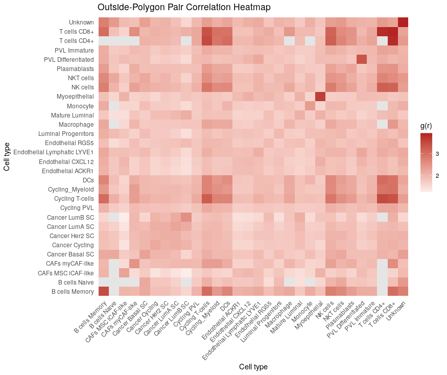
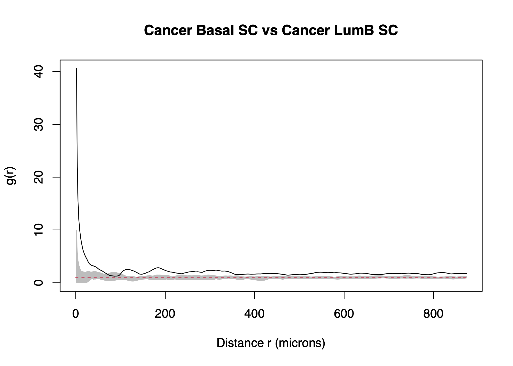

# PCF Analysis

## Introduction

stGradient includes optimized helpers for `spatstat`-based Pair
Correlation Function (PCF) analysis. These functions specifically
analyze spatial co-occurrence of cell types **outside** tumor polygons,
characterizing the peritumoral microenvironment architecture.

## Prerequisites

PCF analysis requires the `spatstat.geom` and `spatstat.explore`
packages:

``` r

install.packages(c("spatstat.geom", "spatstat.explore"))
```

You also need a Seurat object with polygons defined (see [Region
Selection](region-selection.md)).

## Computing PCF Summary

Calculate cross-type PCF values at a specific target distance:

``` r

library(stGradient)

pcf_summary <- calculate_pcf_outside_summary(

  seurat_obj = seurat_obj,
  polygons = auto_polygons,
  distance = 200,
  min_cells = 10,
  celltype_col = "singleR.predicted.id.brcaAtlas",
  include_self_pairs = TRUE,
  ordered_pairs = FALSE
)
```

### Parameters

- `distance` — target radius (microns) at which to evaluate the PCF
- `min_cells` — minimum cells per cell type to include in the analysis
- `include_self_pairs` — whether to compute same-type PCF (e.g., A-A)
- `ordered_pairs` — `FALSE` computes each pair once (A-B); `TRUE`
  computes both (A-B and B-A)

### Interpreting PCF Values

| PCF Value | Interpretation                    |
|-----------|-----------------------------------|
| g(r) = 1  | Random spatial distribution (CSR) |
| g(r) \> 1 | Spatial clustering / attraction   |
| g(r) \< 1 | Spatial repulsion / inhibition    |

## Heatmap Visualization

Visualize all pairwise PCF values as a heatmap:

``` r

plot_pcf_outside_heatmap(pcf_summary, midpoint = 1)
```



The midpoint at 1 represents complete spatial randomness, with warm
colors indicating co-occurrence and cool colors indicating avoidance.

## Envelope Curves

Generate Monte Carlo envelope curves for all cell-type pairs to assess
statistical significance:

``` r

env_list <- plot_pcf_outside_pair_envelopes(
  seurat_obj = seurat_obj,
  polygons = auto_polygons,
  celltype_col = "singleR.predicted.id.brcaAtlas",
  min_cells = 10,
  include_self_pairs = FALSE,
  ordered_pairs = FALSE,
  nsim = 39,
  bw = 10,
  file = "pcf_outside_all_pairs.pdf"
)
```

This creates a multi-page PDF with one page per cell-type pair showing
the observed PCF against simulation envelopes. Points outside the
envelope represent statistically significant spatial patterns.

## Single-Pair PCF Plot

For focused analysis of specific cell-type pairs:

``` r

plot_pcf_pair_gg(env_list[["TypeA_vs_TypeB"]])
```



## Notes

- These PCF helpers analyze **only cells outside polygons** by design
- Increasing `nsim` improves envelope precision but increases
  computation time
- The `bw` parameter controls PCF bandwidth smoothing
- Underlying computation uses the `spatstat` ecosystem

## Next Steps

- [Gene-Distance Analysis](gene-distance-analysis.md) — model gene
  expression as a function of boundary distance
