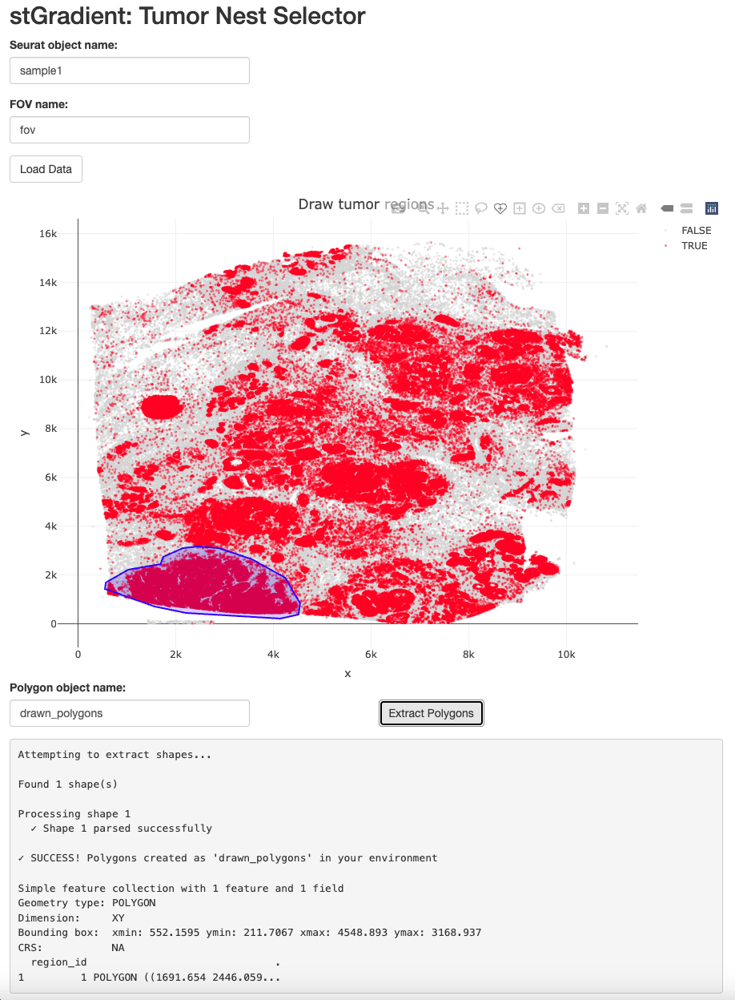
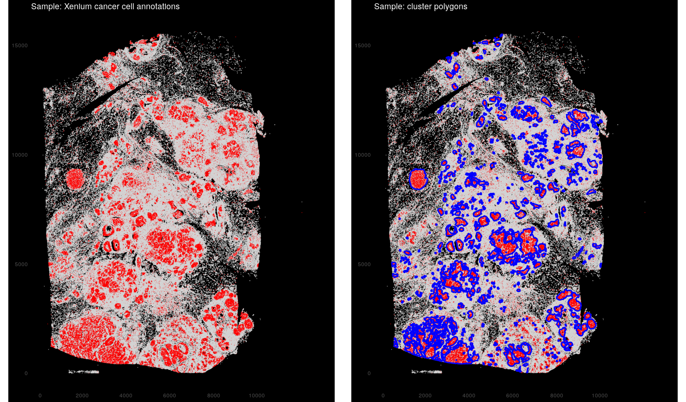
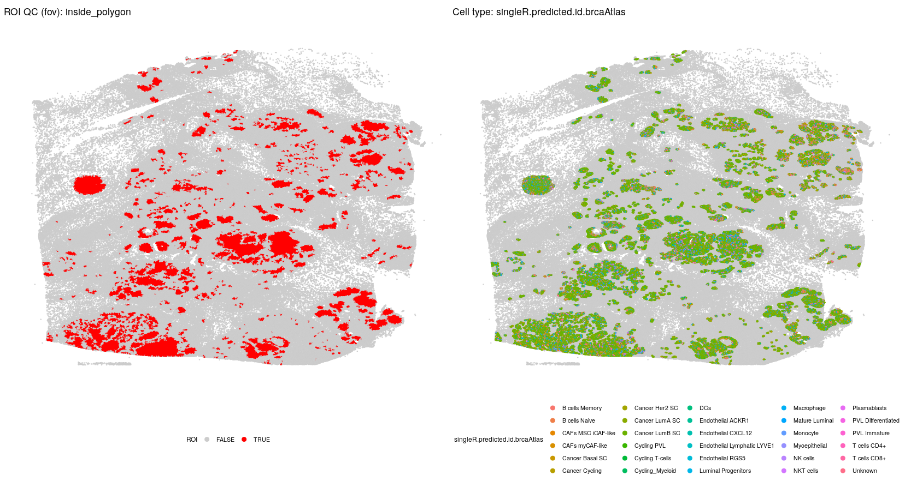
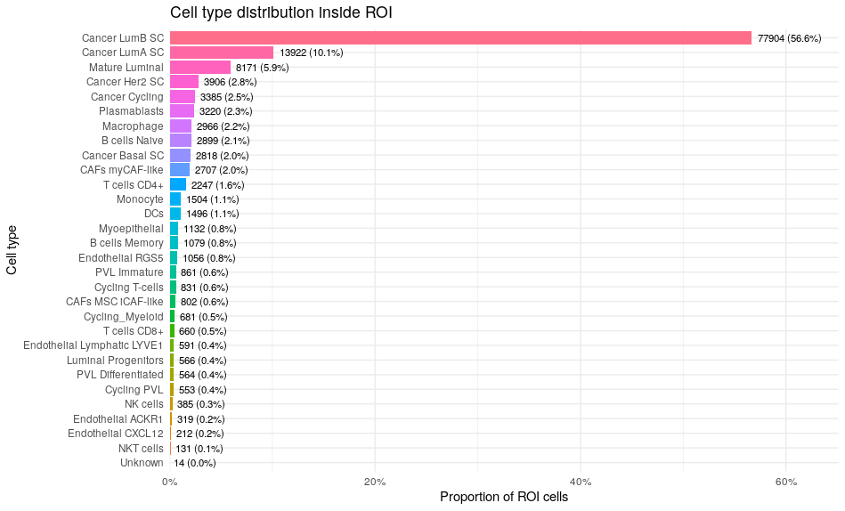
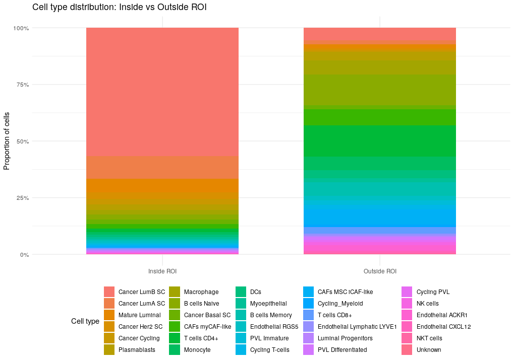
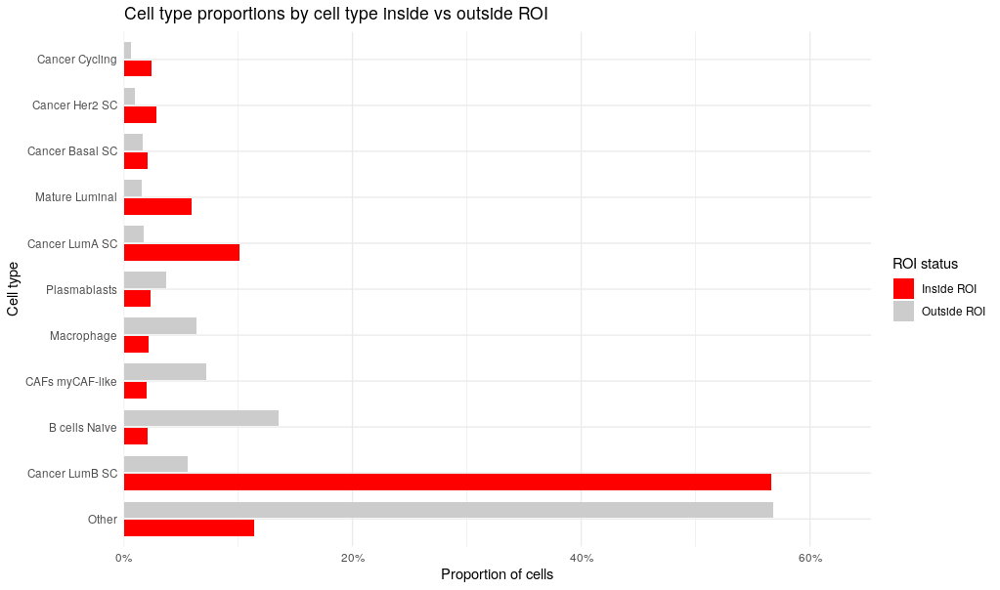

# Region Selection

## Introduction

stGradient provides two approaches for defining tumor regions:

1.  **Interactive selection** via the Shiny app
2.  **Automated detection** using DBSCAN clustering

## Launching the Interactive Polygon Selector

The Shiny app allows you to interactively draw polygons on spatial data
to define tumor regions:

``` r

launch_stGradient()
```

### Workflow in the App

1.  **Enter your Seurat object name** — the name of the object in your R
    session
2.  **Enter FOV name** — the field of view name (typically `"fov"`)
3.  **Click “Load Data”** — loads cell coordinates and plots them
4.  **Draw polygons** — use the freehand drawing toolbar on the plot
5.  **Enter polygon object name** — name for the extracted polygon
    object
6.  **Click “Extract Polygons”** — saves polygons to your global
    environment

The resulting polygon object is an `sf` object that can be passed
directly to downstream stGradient functions. 

## DBSCAN-Based Polygon Detection

The [`add_dbscan_polygons()`](../reference/add_dbscan_polygons.md)
function automatically identifies tumor regions by clustering
cancer-labeled cells using the DBSCAN algorithm, then wrapping detected
clusters in concave hull polygons.

``` r

library(stGradient)

# One-step: detect polygons and add membership to Seurat object
seurat_obj <- add_dbscan_polygons(seurat_obj)

# Access the polygon object
auto_polygons <- seurat_obj@images[["fov"]]@boundaries$cancer_regions
```

### Customizing DBSCAN Parameters

You can tune the clustering behavior:

``` r

seurat_obj <- add_dbscan_polygons(
  seurat_obj,
  eps = 35,         # neighborhood radius (microns)
  minPts = 20,      # minimum cluster size
  concavity = 2     # concave hull tightness (lower = tighter)
)
```

### Visualizing Detected Polygons

Use [`plot_dbscan_polygons()`](../reference/plot_dbscan_polygons.md) to
inspect the results before proceeding:

``` r

# Plot with polygons overlaid
plot_dbscan_polygons(seurat_obj)

# Get polygons without plotting (useful for pipelines)
auto_polygons <- plot_dbscan_polygons(seurat_obj, plot = FALSE)
```



### Optimizing DBSCAN Parameters

If you’re unsure which `eps` and `minPts` values work best for your
data, use
[`optimize_dbscan_params()`](../reference/optimize_dbscan_params.md) to
perform a grid search evaluated by silhouette score:

``` r

# Search over a grid of eps and minPts values
results <- optimize_dbscan_params(seurat_obj)

# View top parameter combinations
head(results)

# Use the best parameters
best <- results[1, ]
seurat_obj <- add_dbscan_polygons(seurat_obj, eps = best$eps, minPts = best$minPts)
```

You can customize the search ranges:

``` r

results <- optimize_dbscan_params(
  seurat_obj,
  eps_range = seq(20, 80, by = 10),
  minPts_range = c(15, 20, 30, 50),
  max_sample = 30000  # reduce for faster computation
)
```

## Adding Polygon Membership

Once you have polygons (from either the Shiny app or DBSCAN), annotate
each cell as inside or outside:

``` r

# Add inside/outside metadata column
seurat_obj <- add_polygon_membership(seurat_obj, auto_polygons)
```

This adds an `inside_polygon` column to `seurat_obj@meta.data` with
logical values.

## QC Visualization

After assigning membership, use
[`qc_plot_xenium()`](../reference/qc_plot_xenium.md) to visualize the
spatial layout:

``` r

qc_out <- qc_plot_xenium(
  obj = seurat_obj,
  roi_col = "inside_polygon",
  celltype_col = "singleR.predicted.id.brcaAtlas",
  show = "both",
  zoom = TRUE,
  zoom_pad = 0.05,
  grey_outside_roi = TRUE
)

qc_out$p
```



### ROI Composition Plots

Examine cell type distributions inside vs. outside the region:

``` r

# Distribution inside ROI only
plot_roi_celltype_dist(
  df = qc_out$df,
  roi_col = "inside_polygon",
  celltype_col = "singleR.predicted.id.brcaAtlas",
  metric = "proportion"
)
```



``` r

# Stacked inside vs outside
plot_roi_inout_celltype_stack(
  df = qc_out$df,
  roi_col = "inside_polygon",
  celltype_col = "singleR.predicted.id.brcaAtlas"
)
```



``` r

#Dodged inside vs outside
plot_roi_inout_celltype_dodge(
  df = qc_out$df,
  roi_col = "inside_polygon",
  celltype_col = "singleR.predicted.id.brcaAtlas",
  metric = "count",
  top_n = 10
)
```



## Next Steps

With regions defined and membership assigned, proceed to [Distance
Metrics](distance-metrics.md) to calculate boundary distances and
separation metrics.
