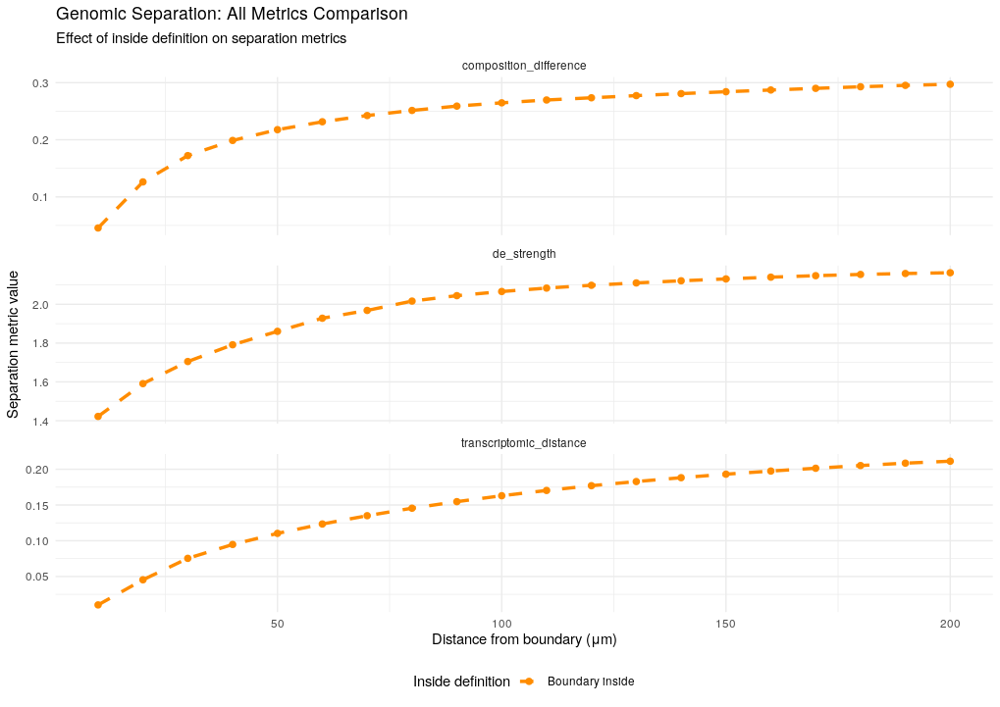
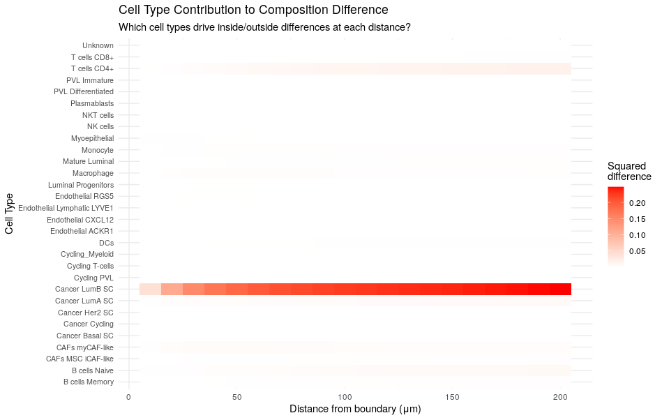
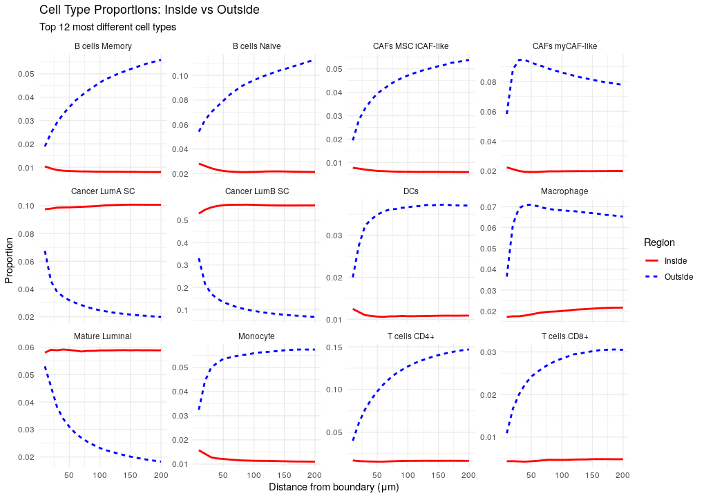

```{r setup, include=FALSE}
knitr::opts_chunk$set(
  collapse = TRUE,
  comment = "#>",
  eval = FALSE
)
```

## Introduction

The core of stGradient is analyzing how genomic features change as a function of distance from tumor boundaries. This vignette covers boundary distance calculation, the available separation metrics, and how to run a distance profile analysis.

## Calculating Boundary Distances

After defining regions (see [Region Selection](region-selection.html)), compute signed distances from each cell to the nearest polygon boundary:

```{r boundary-dist}
library(stGradient)

seurat_obj$boundary_distance <- calculate_boundary_distances(seurat_obj, auto_polygons)
```

Distances are **signed**:

- **Negative** values = cells inside the polygon (tumor)
- **Positive** values = cells outside the polygon (stroma/microenvironment)

## Available Metrics

stGradient computes three complementary separation metrics:

### Transcriptomic Distance

Measures overall gene expression dissimilarity between cell groups (1 - Pearson correlation of mean expression profiles).

```{r transcriptomic}
td <- calculate_transcriptomic_distance(inside_cells, outside_cells, seurat_obj)
```

- Range: 0 (identical) to 2 (anti-correlated)
- Higher values = greater expression differences

### Composition Difference

Sum of squared differences in cell type proportions between inside and outside groups.

```{r composition}
cd <- calculate_composition_difference(inside_cells, outside_cells, seurat_obj, group_by = "cellType")
```

- Range: 0 (identical composition) to ~2
- Independent of sample size

### Differential Expression Strength

Mean absolute log2 fold-change of the top 100 DE genes between groups.

```{r de-strength}
de <- calculate_de_strength(inside_cells, outside_cells, seurat_obj)
```

- Higher values = stronger transcriptional changes at the boundary

## Distance Profile Analysis

The main analysis function calculates all metrics across a range of distances:

```{r profile}
results <- calculate_distance_profile(
  seurat_obj = seurat_obj,
  distance_thresholds = seq(10, 200, by = 10),
  metric = "all",
  group_by = "cellType",
  inside_mode = "all"
)

distance_profile <- results$profile
celltype_contributions <- results$celltype_contributions
```

### Understanding Inside Modes

stGradient supports two modes for defining the "inside" cell group:

| Mode | Inside Cells | Outside Cells | Use Case |
|------|-------------|---------------|----------|
| `"all"` | All cells inside polygon | Cells outside within distance threshold | How does the entire tumor differ from surrounding tissue? |
| `"distance"` | Only cells inside within distance threshold | Cells outside within distance threshold | How do cells at the tumor edge compare on both sides? |

```{r both-modes}
# Compare both modes
results_all <- calculate_distance_profile(seurat_obj, inside_mode = "all")
results_dist <- calculate_distance_profile(seurat_obj, inside_mode = "distance")

combined <- rbind(results_all$profile, results_dist$profile)
```

## Finding Critical Distances

Identify the distance at which separation is maximized:

```{r critical}
critical <- find_critical_distance(distance_profile, "transcriptomic_distance")

cat("Maximum separation at:", critical$max_distance, "μm\n")
cat("Plateau begins at:", critical$plateau_distance, "μm\n")
```

## Visualization

```{r visualize}
# Compare inside modes
plot_distance_comparison(combined)

# All metrics faceted
plot_all_metrics(combined)

# Cell type contribution heatmap
plot_celltype_heatmap(celltype_contributions)

# Proportion trajectories for top cell types
plot_celltype_proportions(celltype_contributions, top_n = 5)
```







## Next Steps

- [PCF Analysis](pcf-analysis.html) — pair correlation functions outside tumor polygons
- [Gene-Distance Analysis](gene-distance-analysis.html) — identify genes associated with boundary distance
